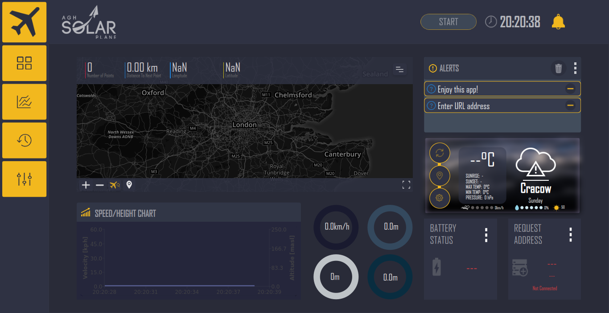

# Solar flight analyser 
> Advanced UAV flight tracker, developed by the AGH UST SolarPlane science research group.

## Table of contents
* [General info](#general-info)
* [Screenshots](#screenshots)
* [Technologies](#technologies)
* [Setup](#setup)
* [Features](#features)
* [Status](#status)
* [Inspiration](#inspiration)
* [Contact](#contact)

## General info
Add more general information about project. What the purpose of the project is? Motivation?
The main purpose of the project is to provide original solution for UAV flight data tracking. The project originates from AGH UST and the main purpose was to develop tool for UAV users and operators to track plane and flight data during unmanned flight. 

## Screenshots

## Technologies
* Qt5
* Qml
* javascript
* C++
* Go
* sqlLite
* Mapbox
* OpenWeatherMap
* JSON
* Mavlink

The program uses comProxy server for Mavlink packets transferring. Visit [@comProxy](https://github.com/AGHSolarPlaneCode/comProxy)for more info.

## Setup
You can build it by yourself, using Qmake or using QtCreator.The program uses mapbox API, to use map functionalities add your own mapbox token. For more visit [@Mapbox website](https://www.mapbox.com/).

## Features
* Route planning with nodes on map
* Weather widget
* Connection issues and alert handling
* Live flight data charts

To-do list:
* Flight data storing
* Settings panel

## Status
Project is still _in progress. Currently being tested for all popular platforms.

## Contact
Created by [@AGH Solar Plane](http://solarplane.agh.edu.pl/?fbclid=IwAR0UkQjEqguk1YbxctuQL0dXhfLmXreBpVWPGhSip6OmkvUPGNGTzUrqTEI) - feel free to contact us!
